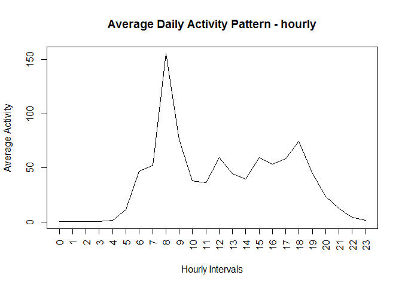

# Reproducible Research: Peer Assessment 1


### Loading and preprocessing the data
Please set the working directory to the location of the data file (activity.csv)


```r
actvty = read.csv('activity.csv')
actvty$hour = actvty$interval %/% 100
```

### What is mean total number of steps taken per day?

```r
options(scipen = 1, digits = 2)
tmp = tapply(actvty$steps, actvty$date, FUN=sum)
hist(tmp, xlab="Steps",main="Distribution of Steps (Amount of Activity)")
```

 

```r
mn = mean(tmp,na.rm=TRUE)
md = median(tmp,na.rm=TRUE)
sd = sd(tmp,na.rm=TRUE)
```
#####Mean of total number of steps taken per day:    10766.19
#####Median of total number of steps taken per day:  10765
#####Standard Deviation of total number of steps taken per day:  4269.18


### What is the average daily activity pattern?

```r
tmp = tapply(actvty$steps, actvty$hour, FUN=mean, na.rm=TRUE)
plot(tmp,x=names(tmp),type='l',main="Average Daily Activity Pattern - hourly",xlab="Hourly Intervals",ylab="Average Activity",xaxt="n")
max_active_hour = names(which(tmp == max(tmp)))
axis(1, "0":"23",las=2)
```

 

```r
tmp = tapply(actvty$steps, actvty$interval, FUN=mean, na.rm=TRUE)
plot(tmp,x=names(tmp),type='l',main="Average Daily Activity Pattern - 5 min intervals",xlab="5 minutes Intervals",ylab="Average Activity")
```

 

```r
max_active_interval = names(which(tmp == max(tmp)))
```

#####Most Active Interval per day :  835
#####Most Active Hour per day :  8


### Imputing missing values

##### Imputation Strategy: Replacing missing steps values by the mean of the same steps across all days

```r
# Calculate the mean of activity for each step across all days
tmp = tapply(actvty$steps, actvty$interval, FUN=mean, na.rm=TRUE)
# Get the subset of the data frame "actvty"" where "steps" are missing  
missing_intrvls = actvty[which(is.na(actvty$steps)),]
# Replace the missing value by the mean value of the same interval
for (i in (1:nrow(missing_intrvls))) {
  impute = tmp[which(names(tmp) == missing_intrvls$interval[i])]
  missing_intrvls$steps[i] = impute
}
# Build a new data frame from the subset of non-missing observations plus the imputed observations
actvty_not_na = actvty[which(!is.na(actvty$steps)),]
imputed_actvty = rbind(actvty_not_na,missing_intrvls)
imputed_actvty = imputed_actvty[order(imputed_actvty$date,imputed_actvty$interval),]
```
##### Make a histogram of the total number of steps taken each day 
##### and Calculate and report the mean and median total number of steps taken per day. 
##### Do these values differ from the estimates from the first part of the assignment? 
##### What is the impact of imputing missing data on the estimates of the total daily number of steps?

```r
tmp1 = tapply(actvty$steps, actvty$date, FUN=sum)
tmp_impute = tapply(imputed_actvty$steps, imputed_actvty$date, FUN=sum)
par(mfcol=c(1,2))
hist(tmp1,xlab="steps",main="Missing values excluded")
hist(tmp_impute,xlab="steps",main="Imputed")
```

 

```r
mni = mean(tmp_impute)
mdi = median(tmp_impute)
sdi = sd(tmp_impute)
```
#####Mean of total number of steps taken per day - after imputation:    10766.19
#####Median of total number of steps taken per day - after imputation:  10766.19
#####Standard Deviation of total number of steps taken per day:  3974.39

#####Imputation strategy seems to be consistent with the overall sample. Mean and Median did not have a noticable move by imputation. The frequency of steps has increased around the mean as expected and the standard deviation of the variable "steps" for the imputed data set versus non-imputed data set is smaller as expected.

### Are there differences in activity patterns between weekdays and weekends?
##### Create a new factor variable in the dataset with two levels - "weekday" and "weekend" indicating whether a given date is a weekday or weekend day.

```r
imputed_actvty$wkday = weekdays(as.Date(imputed_actvty$date))
imputed_actvty$week_day_type = factor(ifelse (imputed_actvty$wkday == "Saturday" | imputed_actvty$wkday == "Sunday","Weekend","Weekday"))
```

##### Make a panel plot containing a time series plot of the 5-minute interval (x-axis) and the average number of steps taken, 
##### averaged across all weekday days or weekend days (y-axis). 

```r
par(mfcol=c(1,1))
library(ggplot2)
ggplot(imputed_actvty, aes(x=interval, y=steps))  + stat_summary(fun.y=mean, geom ="line") + facet_wrap(~ week_day_type, nrow=2)
```

 

```r
ggplot(imputed_actvty, aes(x=hour, y=steps))  + stat_summary(fun.y=mean, geom ="line") + facet_wrap(~ week_day_type, nrow=2)
```

 

#####There are obvious differences between the average of activity during week-days versus weekends
#####* Active day starts later on weekends
#####* First hours of weekday mornings are generally more active than weekends
#####* Afternoon hours of weekends are relatively more active than the same period on weekdays  
#####**********************************************************************************************
